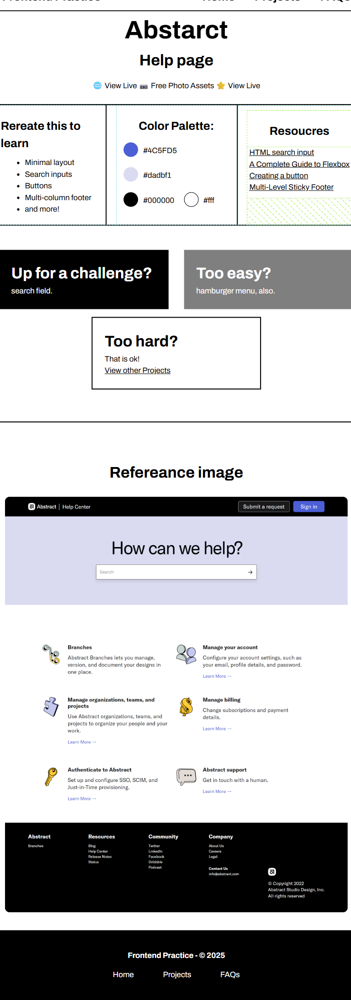

# 📱 Responsive Web Design Project

---

## 🚀 Overview

This project is a demonstration of **pure HTML and CSS skills**, focusing on building a responsive design. It was developed using a **mobile-first approach**, ensuring the layout and content are optimized for smaller screens before scaling up to larger devices.

---

## 🛠️ Technologies Used

- **HTML5:** For the page structure and content.
- **CSS3:** For styling and implementing responsive design principles (e.g., Media Queries).

---

## 🖼️ Project Screenshots

Here are images illustrating the design across different screen sizes:

### 1. Mobile Version

The initial design, optimized for handheld devices.

### 2. Tablet Version

The design adaptation for medium-sized screens.

### 3. Laptop Version

The layout for standard laptop or small desktop screens.

### 4. Desktop Version

The final, fully expanded layout for large displays.

